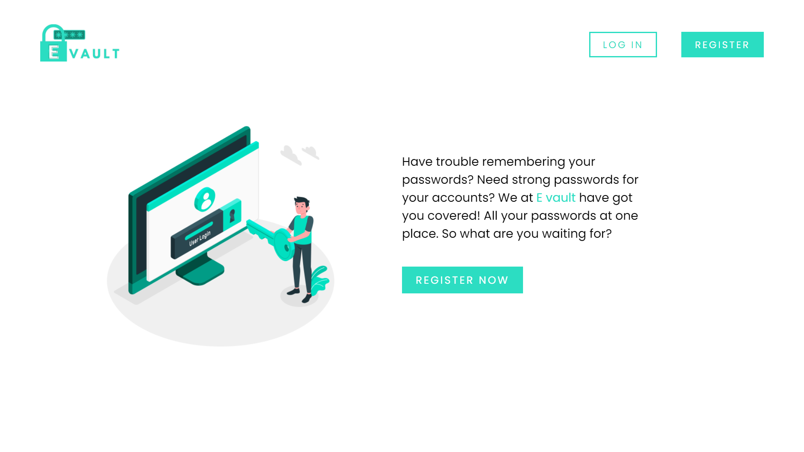
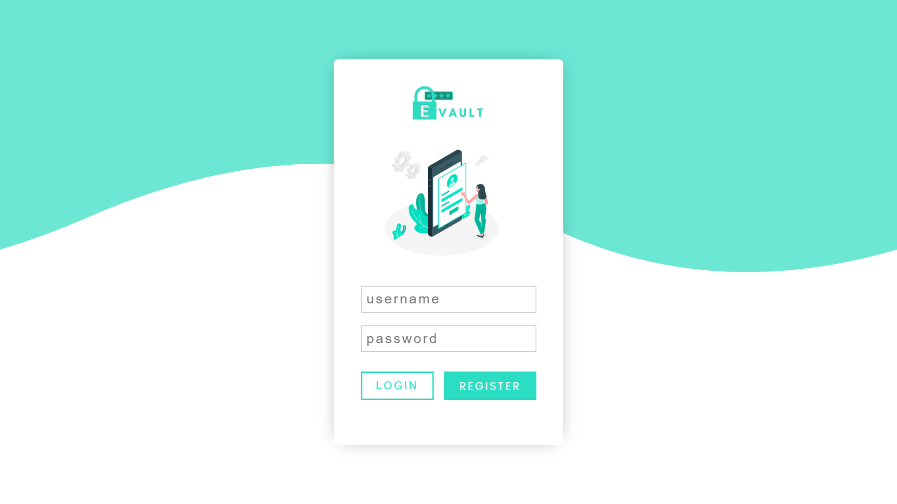
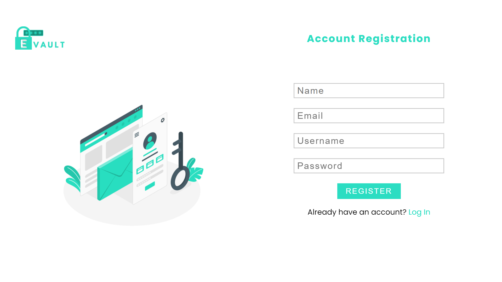
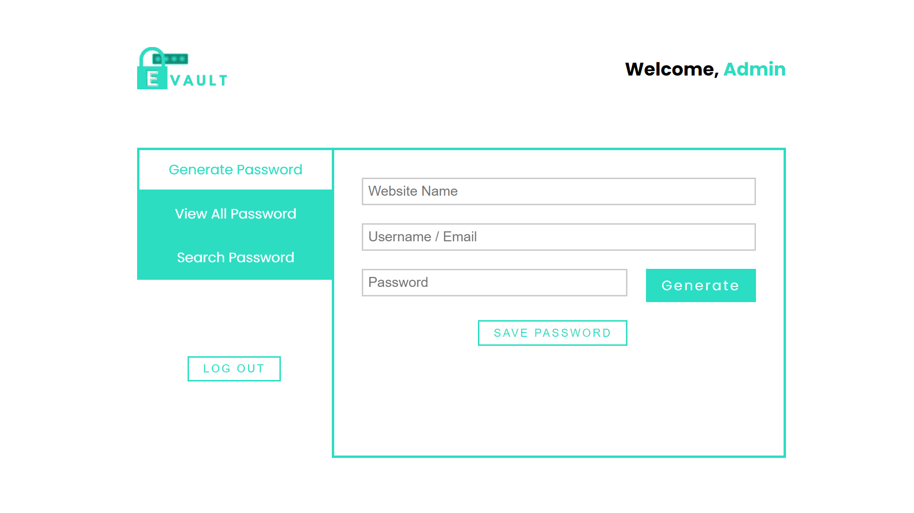

# Password Manager Web Application

A Simple Web application to store and manage your passwords

## Screenshots

- here are some screenshots, alternatively you can also download the `Demo.mp3` file from `screenshots` folder to view a working demo video of the application

### Home Page

### Login Page

### Register Page

### Dashboard

## How to set up

- run `pip install -r requirements.txt` it will install all dependencies

- Install [mongodb](https://docs.mongodb.com/manual/installation/)

- run `app.py` file

## Features

- Users can register/login an account
- Users can generate strong passwords
- Users can save their passwords
- Users can view all their passwords
- Users can search for their passwords

## Built using

- html
- css
- javascript
- python flask framework
- mongodb database

## What I learnt

- Creating a web server using Flask
- creating and working with sessions in flask
- Sending requests from the frontend
- Handling requests at the backend
- Database connectivity
- Sending data from the backend to the frontend

## Socials

🐦 Twitter - [@HMohammedB_](https://twitter.com/HMohammedB_)

📧 Email - hanifmohammed869@gmail.com
